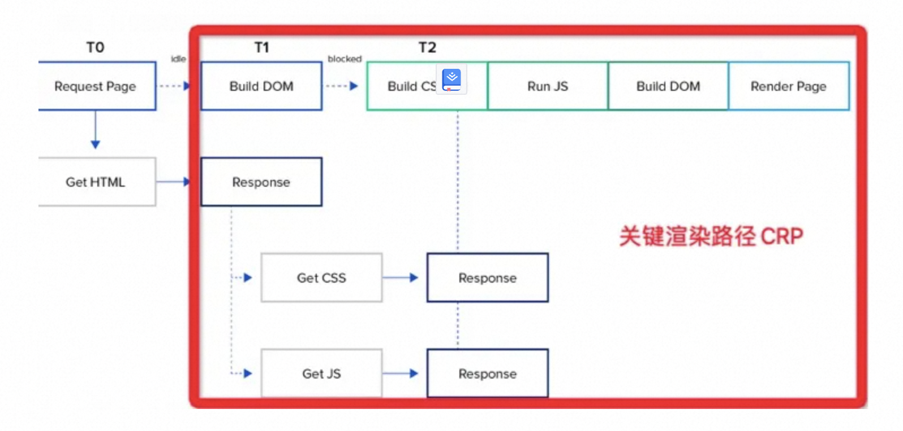
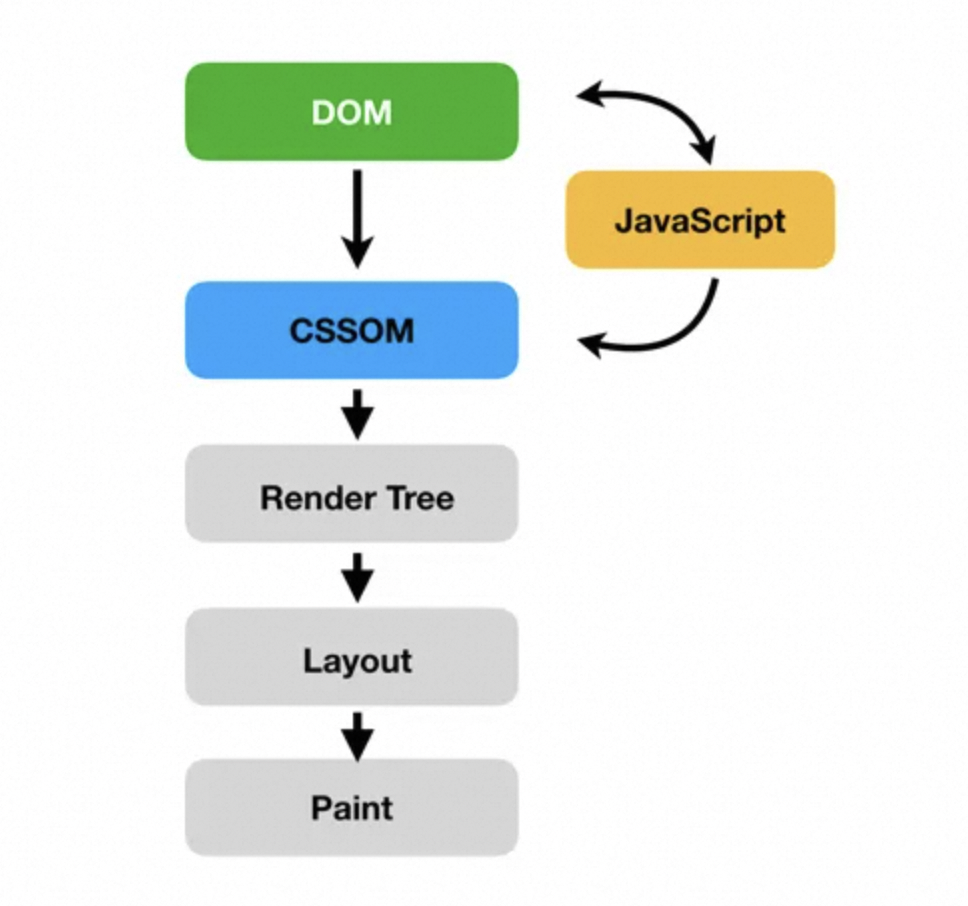
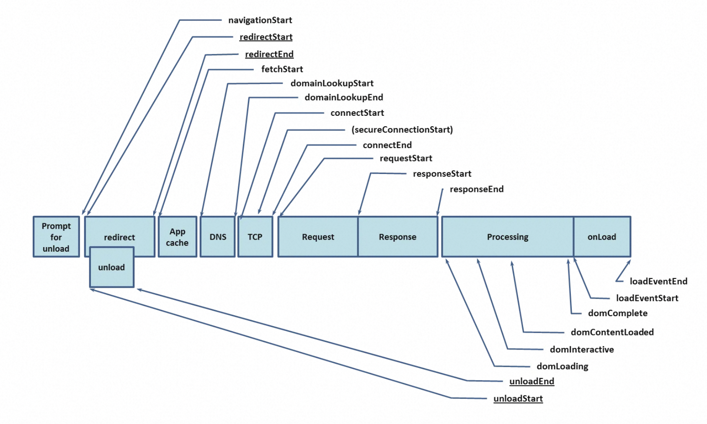

背景
遇到性能优化的问题，大抵都会从两个方向入手：行业标准优化手段、实际性能瓶颈问题。既能够从先进的模式、方法、套路吸收借鉴，又能够结合实际性能情况设计应对方案，已然是高质量工作的路径了，但是，路上还充斥着各种判断和选择，稍有不慎还是会泥足深陷，走上“要你命 3000 ”的道路。

img

在这条“要你命 3000”的道路上，大体可以分为三个部分：感知、愈合、防腐。所谓“感知”，是指对于性能的问题是否能够发现和理解？所谓“愈合”，是指对于发现和理解的性能问题是否能解决？所谓“防腐”，是指性能问题解决之后是否会在未来劣化？这三个部分已经有非常丰富的时间经验、文章和理论，这里不再赘述，我想尝试从全局和系统化的角度，去分享一下我对“渲染性能优化的本质”之愚见，并尝试提出一条从底层原理出发的路径，在渲染性能优化方向上，面对纷繁复杂的问题时，有更加精准和明确的依据和更有价值的方案。

硬件视角
广义上看性能的本质是：在体验、处理能力和功耗三个方向上找到平衡点。我这样定义的灵感是来自于硬件芯片设计，芯片设计从硬件工程视角对芯片要求：面积、性能、功耗三个方向上找到平衡点。在使用 FPGA、CPLD 进行芯片设计和验证的时候，逻辑门数量受到芯片生产工艺和面积的限制而产生一个总体的面积约束，这时候，要使用一些逻辑门组合成专用电路（所谓 IP）从而提升性能并降低功耗（专用电路功耗小于软件加通用电路），否则，只能设计成通用电路如：寄存器操作、通用处理指令……等。因此，可以看出，在条件允许的情况下，专用电路也就是所谓“专业化”能够提供更好的的面积、性能、功耗比。

有同学会问：那这些专业化的电路使用率小于通用化电路的时候怎么办？确实，如此一来性能就会很差，这就是为何 M1 可以帮 Apple 做到行业第一的原因，因为 Apple 从软件生态到操作系统、从底层系统 API 到硬件驱动、从驱动到硬件电子电路设计时全局规划的，这种全局规划保证了软件调用最频繁的系统程序硬件化，在提高性能功耗比的同时也保证了专业化电路的使用率，这就是我所谓的：硬件视角。

又有同学问：你这个是 Apple 的体系 Android 又不能用。确实，Android 作为一个开源生态系统不如 Apple 的封闭系统那么精练、简洁、一致，但是，只要有心，还是可以从 Android 的开源生态系统里找到蛛丝马迹，把这些开源生态系统的能力按照：软件生态到操作系统内、从底层系统 API 到硬件驱动、从驱动到硬件提供的专业电子电路的路径梳理出来，在根据这个路径对应到软件工程上，从硬件视角全局性的看待性能优化问题，充分利用底层硬件的能力。

当初在负责国际浏览器的时候，因为两印和东南亚的基础设施建设落后，移动网络条件非常差带宽感人，多媒体时代的移动互联网充斥着图片和视频，我和团队便一起研究超分辨率（一种用机器学习算法模型预测图像的技术实现传统插值无法达到的 240p 到 720p 超分辨率转换），希望能够给两印和东南亚的 UC 浏览器用户带来更好的体验。

模型和算法在团队的努力下很快就有了突破，我们已经解决了大部分模型预测带来的图像显示错误问题，但整个模型所要求的算力是两印和东南亚移动端设备所无法支撑的，即便我们用尽了降低精度、模型压缩剪枝、知识蒸馏等手段，在红米这种中低端机型（低端机型定义为 1G 内存的 ARMV7 架构处理器）上仍然只有几帧每秒的速度，根本不可用。

于是，我们把目光投向了 ARM NEON 指令优化：一种并行浮点计算和向量运算加速指令集。由于使用的是开源的 XNN 框架，我们有能力对 OP 进行 NEON 的定向优化，从而提升算法模型的前向运算速度，降低对内存和 CPU 的压力，历时近一年的努力，终于做到了每秒 24 帧的 240p 到 720p 超分辨率能力，部署在 UC Browser 上服务两印和东南亚网友。

虽然，之前在软件工程里也经常接触汇编指令优化，但这次从软件（算法模型）到系统 API、从驱动到硬件电子电路的全局优化经历，让我真正感受到硬件视角的重要性。那个每天工作到深夜，自学 Android 编程和 NEON 指令集的算法工程师就是：振奇，他也因为这个项目升到 P8 算法高级专家。

那么，你可能会问：这和前端有什么关系？我尝试举个例子来诠释他们之间的相似性。首先，前端包含了渲染和计算两个部分。渲染部分由 HTML 和 CSS 共同定义，之后，交由浏览器进行渲染，因此，浏览器确实屏蔽了大部分连接到底层能力的部分，造成前端缺乏抓手。但是，随着 WebGL、WebGPU 等全新 API 暴露，前端还是有一些抓手的。计算部分由 JavaScript 定义，之后，交由脚本引擎执行，因此，脚本引擎屏蔽了大部分连接到底层能力的部分，造成前端缺乏抓手，同时，脚本引擎基本都用虚拟机屏蔽底层指令集和硬件差异，因此，又多了一层屏蔽。但是，随着 Node.js 和 WASM 等技术让部分程序 Local 化本地执行，随着 V8 引擎用一些特殊策略让部分 JavaScript 被 Sparkplug 编译成 Local 代码执行，这种情况也会有所改变。（参考：https://v8.dev/blog/sparkplug）

image-20210727145642140

摘自 V8 团队博客 Sparkplug 介绍
因此，前端已经在很多场景中穿透 浏览器/webview 更直接的和底层硬件打交道，硬件视角将成为：在体验、处理能力和功耗三个方向上找到平衡点的关键，接下来，将针对渲染、计算这两个渲染性能优化的核心场景分别进行介绍。

渲染视角
其实，在上文中 HTML 和 CSS 定义了渲染的说法过于粗糙，精确的表述应该是：HTML 和 CSS 定义了渲染的内容，而 JavaScript 可以干预内容和渲染过程。没有 JavaScript 的干预，HTML 和 CSS 定义的渲染就是静态 HTML 页面的渲染（由于动画和视频等比较特殊，不在本文讨论），在 DHTML 和 XSLT 销声匿迹后，动态渲染更多是由 JavaScript 完成的，这体现了解耦后各司其职的优势，同时，把动态渲染能力从简单的 API 调用提升到编程语言的复杂逻辑控制，释放无限的可能性。综上所述，我把渲染视角拆分为：渲染内容、渲染过程、JavaScript 干预三个部分，分别阐释一下我的理解。

渲染内容
首先，WWW 的出现将人类从信息孤岛推向了互联互通的万维网时代，而信息的载体就是 Web 上的 HTML 俗称：超文本标记语言，彼时，将 HTML 渲染出来的核心是排版引擎，Web 标准也是围绕着排版展开的。随着技术发展，人们对于排版出来的静态内容逐渐疲劳，DHTML 和 XHTML（XML + XSLT）等技术和高级的 API 如：HTTPWebRequest ……带来了动态能力，Flash、Silverlight、JavaAplate ……等技术带来了富客户端能力，随着 Web 2.0 去中心化打破门户的垄断，整个互联网产业带来了空前的繁荣。

随着行业的发展和技术的进步，渲染内容从最初的“文档排版”承载简单信息，到“富媒体”承载多媒体信息，再到今天的增强现实技术 WebXR 承载复杂的数字和现实混合信息，渲染内容对 渲染引擎、显示能力、硬件加速能力都提出了不同的要求。最简单的说，任何一个引擎都会把 Animation 相关 API 单独拎出来，从而区分这种高负载的渲染工作，在框架和底层引擎上进行特殊优化。

此外，在显示能力上渲染内容的不同也会产生差异，最常见是分辨率、HDR……等内容对显示能力有特殊的要求。硬件加速则更容易理解，针对不同负载的渲染工作，首先降低 CPU 、内存、磁盘 I/O 的压力，其次是更多用 GPU 、DSP 等专业电子电路进行替代，从而达到更高的性能/功耗比。

了解这些是为了区分软件工程里构建内容，这些内容的选择对渲染性能有决定性的影响，这种差异又受限于底层的硬件如：CPU、GPU、DSP、专业加速电路……等，因此，他们是从内容解析开始，到底层硬件加速能力，浑然一体且密切相关的。即便在浏览器引擎的屏蔽下缺少直接控制的能力，对于选择何种内容的表达方式（端应用里 UI 控件和 Draw API 选择、Web 里 HTML 标记和 CSS 样式选择对 Paint 的影响……等）都需要有穿透到底层的视角和理解力，才能在“要你命 3000 ”的基础上描绘一条更接近问题本质的优化路径。

拿端应用里 UI 控件和 Draw API 选择来说，内容对 API 选择有很大的限制。2016年刚带浏览器团队的时候，我研读了 Servo 的源码，这是一个 Mozilla 和三星共同开发的下一代浏览器引擎（题外话：因为 Servo 双方程序员发明了伟大的 Rust 编程语言，我非常喜欢并学了很长时间，推荐大家了解一下），Servo 的开源项目里提供的 Demo 是使用 Android 的 SurfaceView 来保证浏览器渲染性能。不使用 View 的原因是因为 View 通过系统发出 VSYNC 信号进行重绘，刷新时间间隔是 16ms ，如果不能再 16ms 完成绘制就会造成界面的卡顿，因此，Servo 选择了 SurfaceView 来解决这一问题。更深层次去看，其实，本质上是因为 HTML 复杂和动态的内容决定了 View 不合适，可以想见，用 View 不断局部刷新将给页面带来闪烁，而 SurfaceView 的双缓冲技术可以把要处理的图片在内存里处理好后，在将其显示在屏幕上，这样就解决了 Servo 显示 HTML 内容的问题。同样的，很多游戏选择双缓冲技术也是因为显示的内容是“游戏”。

OpenGL 里 GPU 有两种渲染方式：当前屏幕渲染和离屏渲染，光栅化、遮罩、圆角、阴影会触发离屏渲染，而离屏渲染需要创建独立的缓冲区、多次切换上下文环境（On-Screen到Off-Screen转换），最后再把上下文从离屏切换到当前屏幕以显示离屏缓冲区的渲染结果。所有这些只是 API 能力，而内容的选择决定了光栅化、遮罩、圆角、阴影的触发和性能的耗散，这背后就体现了渲染内容对底层和硬件的影响。

前端和端应用的原理是一样的，不同的地方在于前端的路径更长，视角穿透到底层和硬件的难度更大，因为，前端的宿主环境：浏览器/浏览器内核/渲染引擎 是在系统的 UI 引擎和渲染引擎之上又包裹了一层。同时，这一层包裹还涉及不同浏览器厂商在不同平台上的不同实现。但是，随着 WebGL 和 WebGPU……等技术在前端领域的应用，穿透到底层和硬件的难度被这种平行技术能力所简化和降低了，前端甚至在视角穿透到底层和硬件的同时，对底层和硬件具备了一定的干预能力，尤其是内容渲染的硬件加速能力，让渲染内容的设计和实现具备了更宽松的环境。

具备了渲染内容的把控力，实现上就不必赘述了，很简单的一远一近两步即可。所谓“一远”是指根据业务需求和产品设计把视角穿透到底层和硬件审查技术能力可以带来什么新的、有意思的东西。所谓“一近”就是收回视角选择合适的 UI 控件和 Draw API、HTML 标记和 CSS 去构建要渲染的内容，剩下的就是中间的渲染过程。

渲染过程
从成像原理上说，渲染过程包括：CPU 计算（UI 引擎或浏览器引擎、渲染引擎的工作）、图形渲染 API （OpenGL/Metal）、GPU 驱动、GPU渲染、VSYNC 信号发射，HSYNC 信号发射的过程。常见的渲染问题有：卡顿、撕裂、掉帧……，卡顿、撕裂、掉帧通常都是渲染时间过长造成，渲染时间问题大多数情况下是耗费在 CPU 计算上，部分情况下是耗费在图形渲染上，怎么理解呢？其实很简单，把一个渲染性能很差的复杂页面用高端机流畅渲染过程录屏，再拿个低端机播放录屏的视频并在同一个手机上打开页面让浏览器进行渲染，图像复杂度没有差异渲染性能上视频播放却比页面渲染快很多，这就是在展示 CPU、GPU 计算和图形渲染的耗时，因为视频的解码和渲染相较浏览器引擎更加简单且渲染过程更短。（特殊编解码格式和高码率的视频除外）

因此，从渲染过程来看，性能优化的本质在首先于降低 CPU、GPU 计算负载。其次，如果有条件（实现差异对业务有影响需要说服业务方）通过不同的渲染内容构建方法去影响渲染过程的话，优先选择有 CPU、GPU 优化指令和专用电子电路加速的底层 API 来构建渲染内容。例如在 H.264 硬件加速普及的今天，是否应该用 X.265 / H.265 就值得商榷。

在探讨渲染过程的时候，流畅性指标是首先需要关注的，根据 60Hz 刷新率下 16.6ms 的帧渲染速度，可以从时间角度定义 16.6ms x 2 （双缓冲）、16.6ms x 3（三缓冲）的 CPU 和 GPU 处理时间，压缩渲染过程来保证流畅度。

image-20210728104629017

OOPD (Out of Process Display Compositor，进程外 Display 合成器)，它的主要目的是将 Display Compositor 从 Browser 进程迁移到 Viz 进程（也就是原来的 GPU 进程），Browser 则变成了 Viz 的一个 Client，Renderer 跟 Viz 建立链接（CompositorFrameSink）虽然还是要通过 Browser，但是建立链接后提交 CompositorFrame 就是直接提交给 Viz 了。Browser 同样也是提交 CompositorFrame 给 Viz，最后在 Viz 生成最终的 CompositorFrame，通过 Display 交由 Renderer 合成输出。

OOPR (Out of Process Rasterization，进程外光栅化)OOPR 跟目前的 GPU 光栅化机制的主要区别是：

在当前的 GPU 光栅化机制中，Worker 线程在执行光栅化任务时，会调用 Skia 将 2D 绘图指令转换成 GPU 指令，Skia 发出的 GPU 指令通过 Command Buffer 传送到 Viz 进程的 GPU 线程中执行；
在 OOPR 中，Worker 线程在执行光栅化任务时，它直接将 2D 绘图指令（DisplayItemList）序列化到 Command Buffer 传送到 GPU 线程，运行在 GPU 线程的部分再调用 Skia 去生成对应的 GPU 指令，并交由 GPU 直接执行；
简而言之，就是将 Skia 光栅化的部分从 Renderer 进程转移到了 Viz 进程。当 OOPD，OOPR 和 SkiaRenderer 都开启后：

光栅化和合成都迁到了 Viz 进程；
光栅化和合成都使用 Skia 做 2D 绘制，实际上 Chromium 所有的 2D 绘制最终都交由 Skia 来做，由 Skia 生成对应的 GPU 指令；
光栅化和合成时，Skia 最终输出 GPU 指令都在 GPU 线程，并且使用同一个 Skia GrContext（Skia 内部的 GPU 绘图上下文）；
image-20210728153718620

这意味着，当 Skia 对 Vulkan，Metal，DX12 等其它 3D API 的支持完善后，Chromium 就可以根据不同的平台和设备，来决定 Skia 使用哪个 GPU API 来做光栅化和合成。而 Vulkan，Metal，DX12 这些更 Low Level 的 API 对比 GL API，可以带来更低的 CPU 开销和更好的性能。

纵观渲染过程，不同的 Low Level API 受到光栅化过程影响，光栅化过程受到合成器工作过程影响，合成器工作过程受到 Blink 对渲染内容处理的影响：

image-20210728153932606
参考 Chromium 团队文档
对渲染过程感兴趣可以看一下这个文档：Life of a Pixel[https://docs.google.com/presentation/d/1boPxbgNrTU0ddsc144rcXayGA_WF53k96imRH8Mp34Y/edit?spm=ata.28742492.0.0.634a3139BC9mfG#slide=id.ga884fe665f_64_1800]，对于渲染过程的学习和理解，可以了解渲染内容的不同选择对于性能的影响过程，对于性能影响过程的分析可以精确定位性能问题，同时，了解渲染过程会产生很多优化手段去对抗白屏、掉坑、闪烁、卡顿……等性能和用户体验问题。

上述相对较多的介绍静态渲染内容，但是，今天的软件工程面对着复杂的、动态的场景，比如：数据动态加载和动态渲染、条件渲染、动效动画……等，因此，JavaScript 的干预也会导致渲染内容的变化，从而影响渲染的过程，下面，介绍一下 JavaScript 干预的相关问题。

JavaScript 干预
image-20210728183353111

从原理上说 Blink 暴露 DOM 的 API 给 JavaScript 调用（其实，这里还有一部分 CSSOM API 的暴露，用于干预 CSS ，这里就不赘述了，因为现代前端开发框架大多会直接将这部分干预结果内联到 HTML 里，借此降低浏览器引擎的计算量），如上图 createElement 一个 HTML 标记 append 到 document.body.firstChild 的 childNodes[1] 之上，也就是左图 P2 ，DOM Tree 会发生变化导致整个渲染过程发生变化：

这也就是 Virtual-Tree 技术能够提高浏览器渲染性能的原理：合并 DOM Tree 的变更进行批量 bindings 从而降低重入渲染过程的几率和频次。

简单说，从 Blink 的视角看 V8 其实是一个局外人，浏览器引擎良好的解耦了 V8 对 DOM 的干预，让这种干预局限在针对 HTML 标记本身上，但是，由于 JavaScript 的干预会导致 DOM 的变化，所以，同样会导致后续的渲染过程产生变化，因此，有时候合并 DOM Tree 的变更可能带来渲染结果的错误，在不了解渲染过程的前提下，使用 Virtual-Tree 出现一些渲染的问题可能更加难以定位和解决。

其次，在一些条件渲染或 SPA 应用的一些路由逻辑上，也会因为渲染内容的选择和改变对渲染过程产生负面的影响，这种影响可能会超出 16.7ms 的限制而造成卡顿等问题，条件和判断逻辑的优化很可能能够缓解部分渲染性能问题（由于这属于 JavaScript 的范畴就不在此展开了），一句话概括：JavaScript 尽快执行和返回。下文将从 Passer 、Layout 、Compositor 的计算视角去分析：计算复杂度对渲染性能的影响。

计算视角

简单来说，计算视角就是看：DOM、style、layout、comp.assign、paint（including prepaint）这个渲染过程中计算的部分，因为，这些计算的耗时会直接影响渲染性能。关于这个过程行业里有一个 CRP 的概念，下面就从 CRP 开始，看看计算视角下渲染性能优化的问题和手段。

CRP 概览
通过网络 I/O 或磁盘 I/O （缓存）加载 HTML CSS 之后的链路：解码 HTML、CSS 文件（GZip 文本传输前压缩等）、处理过程（HTML、CSS Passing）、DOM Tree 构建、Style 内联、布局、合成器、绘制，这里涉及浏览器引擎进行大量的解析和计算等处理过程，为此，需要引入一个概念：关键渲染路径（Critical Rendering Path），简称：CRP （以下部分内容摘自大漠老师和我一起梳理的部分内容） 
  
首先，一旦浏览器得到响应，它就开始解析它。当它遇到一个依赖关系时，它就会尝试下载它

如果它是一个样式文件（CSS文件），浏览器就必须在渲染页面之前完全解析它（这就是为什么说CSS具有渲染阻碍性）

如果它是一个脚本文件（JavaScript文件），浏览器必须： 停止解析，下载脚本，并运行它。只有在这之后，它才能继续解析，因为 JavaScript 脚本可以改变页面内容（特别是HTML）。（这就是为什么说JavaScript阻塞解析）

一旦所有的解析工作完成，浏览器就建立了 DOM 树和CSSOM树。将它们结合在一起就得到了渲染树。

倒数第二步是将渲染树转换为布局。这个阶段也被称为 重排

最后一步是绘制。它涉及到根据浏览器在前几个阶段计算出来的数据对像素进行字面上的着色

把这几步放到渲染引擎渲染页面的过程中来，就能更清晰的认识到，CRP 会经过下面几个过程：

简单地说，CRP 的步骤：

处理 HTML 标记并构建 DOM 树

处理 CSS 标记并构建 CSSOM 树

将 DOM 树和 CSSOM 树合并大一个渲染树

根据渲染树来布局

将各个节点绘制到屏幕上

注意：当 DOM 或者 CSSOM 发生变化的时候（JavaScript可以通过 DOM API 和 CSSOM API 对它们进行操作，从而改变页面视觉效果或内容）浏览器就需要再次执行上面的步骤，上文介绍的 Virtual-Tree 渲染优化就源自这里

优化页面的关键渲染路径（Critical Rendering Path）三件事：

减少关键资源请求数: 减小使用阻塞的资源（CSS 和 JS），注意，并非所有资源是关键资源，尤其是 CSS 和 JS（比如使用媒体查询的 CSS，使用异步的 JS 就不关键了）

减少关键资源大小：使用各种手段，比如减少、压缩和缓存关键资源，数据量越小，引擎计算复杂度越小

缩短关键渲染路径长度

在具体优化 CRP 时可以按下面的常规步骤进行：

对 CRP 进行分析和特性描述，记录 关键资源数量、关键资源大小 和 CRP 长度

最大限度减少关键资源的数量：删除它们，延迟它们的下载，将它们标记为异步等

优化关键资源字节数以缩短下载时间（往返次数），减少 CRP 长度

优化其余关键资源的加载顺序，需要尽早下载所有关键资源，以缩短 CRP 长度

使用 Lighthouse 或 Navigatio Timing API 检测关键请求链
我们需要一些工具帮助我们检测 CRP 中一些重要指标，如：关键资源数量、关键资源大小 、CRP 长度等。在Chrome中使用 Lighthouse插件，Node 版本的 Lighthouse:

// 安装lighthouse
» npm i -g lighthouse 

» lighthouse https://jhs.m.taobao.com/ --locale=zh-CN --preset=desktop --disable-network-throttling=true --disable-storage-reset=true --view
可以得到一份详细报告，在这份报告中可以看到 ”关键请求“ 相关的信息：

image.png

更详细的可以查阅 Lighthouse 官网文档

除了使用 Lightouse 检测工具之外，还可以使用 Navigation Timing API 来捕获并记录任何页面的真实 CRP 性能。

我们也可以使用性能监控规范中相关 API 来对页面真实用户场景的性能监控：

img

通过相应工具或技术手段获得 CRP 分析结果之后，就可以针对性的进行优化。

CRP 优化策略
完整内容请等待大漠老师的文章发表，我这边只列举计算视角下相关的部分。

计算视角下的 HTML
编写有效的可读的 DOM:

用小写字母书写，每个标签都应该是小写的，所以请不要在HTML标签中使用任何大写字母
关闭自我封闭的标签
避免过渡使用注释（建议使用相应工具清除注释）
组织好DOM，尽量只创建绝对必要的元素
减少 DOM 元素的数量（在 Blink 内核的 HTMLDocumentParser 处理中 Token 的个数和 DOM 元素数量息息相关，减少 Token 数量可以加快 DOM Tree 的构建，从而加快排版渲染首帧的速度），因为页面上有过多的 DOM 节点会减慢最初的页面加载时间、减慢渲染性能，也可能导致大量的内存使用。因此请监控页面上存在的DOM元素的数量，确保你的页面没有：

没有超过 1500 个 DOM 节点
DOM节点的嵌套没有超过 32级
父节点没有 60 个以上的子节点
参考：https://zhuanlan.zhihu.com/p/48524320《浏览器内核原理--Chromium Blink Html解析》by 不穿格子衫的程序猿

计算视角下的 CSS
CSS类（class）的长度：类名的长度会对 HTML 和 CSS 文件产生轻微的影响 （在某些场景下存有争议，详细参阅 CSS 选择器性能）

关键CSS（Critical）:将页面 CSS 分为关键 CSS （Critical CSS）和 非关键CSS（No-Critical CSS），关键CSS 通过 <style> 方式内联到页面中（尽可能压缩后引用），可以使用 critical 工具来完成（详细参阅 关键CSS）

使用媒体查询：符合媒体查询的样式才会阻塞页面的渲染，当然所有样式的下载不会被阻塞，只是优先级会调低。

避免使用 @import 引入CSS：被 @import 引入的 CSS 需要依赖包含的 CSS 被下载与解析完毕才能被发现，增加了关键路径中的往返次数，意味着浏览器引擎的计算负载加重。

分析样式表的复杂性：分析样式表有助于发现有问题的，冗余 和重复的 CSS 选择器。分析出 CSS 中冗余和重复 CSS选择器，可以删除这些代码，加速 CSS 文件读取和加载。可以使用 TestMyCSS、analyze-css、Project Wallace 和 CSS Stats来帮助你分析和更正CSS代码

//如果结点有id属性
if (element.hasID()) 
  collectMatchingRulesForList(
      matchRequest.ruleSet->idRules(element.idForStyleResolution()),
      cascadeOrder, matchRequest);
//如果结点有class属性
if (element.isStyledElement() && element.hasClass()) { 
  for (size_t i = 0; i < element.classNames().size(); ++i)
    collectMatchingRulesForList(
        matchRequest.ruleSet->classRules(element.classNames()[i]),
        cascadeOrder, matchRequest);
}
//伪类的处理
...
//标签选择器处理
collectMatchingRulesForList(
    matchRequest.ruleSet->tagRules(element.localNameForSelectorMatching()),
    cascadeOrder, matchRequest);
//最后是通配符
...
可以通过代码，直观的感受不同 CSS 选择器带来的计算开销差异，从而对优化计算性能提供指导。参考：https://nextfe.com/how-chrome-compute-css/《从Chrome源码看浏览器如何计算CSS》by 李银城

优化计算本身
浏览器引擎本身也是软件，在了解了渲染过程后，其实就了解了渲染的软件细节。那么，软件工程角度优化计算的方法其实是比较丰富的，如果把编程对象理解为：算法 + 数据结构 这个理论相信大家都熟悉，我想说的是：算法 + 数据结构 从性能优化视角下可以看做：时间 + 空间。由此，可以引入一个比较常用的性能优化策略：时间换空间 or 空间换时间。当空间压力大的时候（也就是存储压力大），可以用时间来换空间，典型的案例是：文件压缩。当时间压力比较大的时候（也就是计算压力大），可以用空间来换时间，典型案例是上文说到的：缓冲区（缓存），利用把长进程运算密集型任务分割成一系列可并发的子任务，并行计算后存储起来（缓冲区/缓存），再由 GPU 输出到 Display 上。

image-20210729105948139

以下，通过 Layout 和 Compositing 的实例，分析一下计算视角下渲染性能的问题。

Layout 实例
除了 CRP 前文所述的 HTML 、CSS 的部分优化思路外（解决下图 DOM、style 部分），渲染流水线包括：

image-20210729153406834

图中红框部分 CPU 和 GPU 渲染流水线耗时部分，就是渲染流水线优化方向。

核心思路：减少渲染流水线计算负载

image-20210729163322406

image-20210729163301269

不同的 HTML 标记和 CSS 样式选择，以及我们在其中使用的布局方法，会在不经意间，对布局引擎产生计算负载。避免这种负载的产生，就是让布局引擎尽可能少的计算，可以用前文所述空间换时间的方法，用确定性的数值去避免布局引擎的估计或计算。参考：https://www.chromium.org/developers/design-documents/multi-column-layout

注意，这里提供的不是具体的渲染性能优化方法，而是思路。因此，在具体项目里使用这个思路，还需要额外的工作，包括：调试能力、统计分析能力……，最常用的就是对 Chromium 内核进行调试，找到计算负载的根源。以打开一个页面为例，我们把断点打在blink中，源码为 third_party/blink/renderer/core/dom/http://document_init.cc 中的 DocumentInit::Type DocumentInit::ComputeDocumentType

image-20210729164312496

参考：https://zhuanlan.zhihu.com/p/260645423《Chromium源码学习（1）—— 构建，调试》by mark-0xg

「 The performance goal of the Blink project is to be able to run web content at 60fps on a mobile phone, which means we have 16ms per frame to handle input, execute scripts, and execute the rendering pipeline for changes done by scripts through style recalculation, render tree building, layout, compositing, painting, and pushing changes to the graphics hardware. So style recalculation can only use a fraction of those 16ms. In order to reach that goal, the brute force solution is not good enough.

At the other end of the scale, you can minimize the number of elements having their style recalculated by storing the set of selectors that will change evaluation for each possible attribute and state change and recalculate computed style for each element that matches at least one of those selectors against the set of the descendants and the sibling forest.

At the time of writing, roughly 50% of the time used to calculate the computed style for an element is used to match selectors, and the other half of the time is used for constructing the RenderStyle (computed style representation) from the matched rules. Matching selectors to figure out exactly which elements need to have the style recalculated and then do a full match is probably too expensive too.

空间换时间部分：

We landed on using what we call descendant invalidation sets to store meta-data about selectors and use those sets in a process called style invalidation to decide which elements need to have their computed styles recalculated. 」

参考：https://docs.google.com/document/d/1vEW86DaeVs4uQzNFI5R-_xS9TcS1Cs_EUsHRSgCHGu8/edit?usp=sharing《Style Invalidation in Blink》by rune@opera.com

Compositing 实例
核心思路：找到渲染引擎设计者为之努力优化的问题并避免之。

简单来说，在阅读 Chromium 等浏览器内核设计文档或博客的时候，经常看到一些设计方案在阐述 Blink 内核团队遇到的问题和他们解决问题的思路与设想，那么，如果换个思路来看，避免了解引发这些渲染性能问题的原因，并在自己的项目中避免这些情况的发生，就能够良好的进行优化。

文章：

https://www.chromium.org/developers/design-documents/impl-side-painting《Multithreaded Rasterization》

问题：

image-20210729173131486

大漠老师提供的示例：

 background: url(//www.textures4photoshop.com/tex/thumbs/watercolor-paint-background-free-thumb32.jpg) repeat center center;  background-size: 20%;
watercolor text with texture

此外，就是研读一些：https://www.chromium.org/developers/design-documents/compositor-thread-architecture 《Compositor Thread Architecture》之类的文档，了解在合成过程中 CPU、GPU、内存（空间大小、换入换出、内存对齐……等阻滞计算过程的内存问题也会产生计算负载，因为这会拉长计算时间）都在发生什么？什么情况或条件会产生线程间切换？什么问题会引发资源竞争？从这些问题入手反思：我们交给 Compositor 的是不是最合适的？用这种逆向思维的方式发现计算瓶颈并针对性的优化。同时，这些思想的根源都是很朴素的软件工程能力和编程能力，在无法觉察和理解这些问题的时候，不妨把这些基础软件工程能力和编程能力补一补，例如看看：《UNIX 网络编程》这样的著作。（https://book.douban.com/subject/1500149/和https://book.douban.com/subject/4886882/）

总结
高质量完成渲染性能优化，用“要你命 3000 ”的方法会有明显的瓶颈：你无法做的比别人好。只有层层深入从：解码 HTML、CSS 文件（GZip 文本传输前压缩等）、处理过程（HTML、CSS Passing）、DOM Tree 构建、Style 内联、布局、合成器、绘制开始，再到 WebGL、Vulkan、Skia 等底层编程接口，最后到硬件视角下自己的页面是如何被渲染出来的。了解的越多、越深越能够发现更深层次、更有价值的问题，结合自己不断磨练的编程能力和软件工程能力，就能提出一些属于自己的解决方案，从而：做的比别人好！